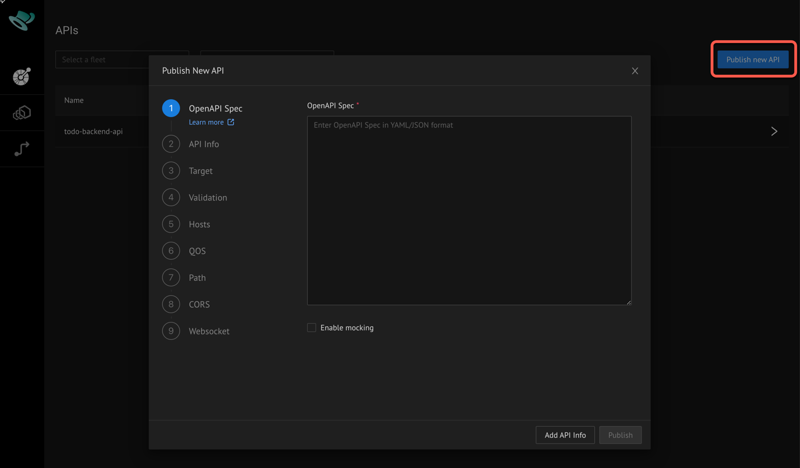

# Deploying APIs 

The Kusk Dashboard contains a wizard for helping you deploy your vanilla OpenAPI definitions to Kusk Gateway. It will
prompt and add any required `x-kusk` extensions for you, so you can try different configurations without having to 
add the corresponding properties manually.

Open the wizard with the "Publish new API" button on the top right.

Paste your OpenAPI 3.x definition in the initial text field and proceed through the steps of the wizard as needed. As
soon as your API has enough configuration to be publishable, the "Publish" button in the bottom right will be enabled,
allowing you to bypass any steps that aren't further required.

For example, if you select "Enable mocking" on the first page, you can immediately publish your API, as it requires
no other configuration when being mocked.