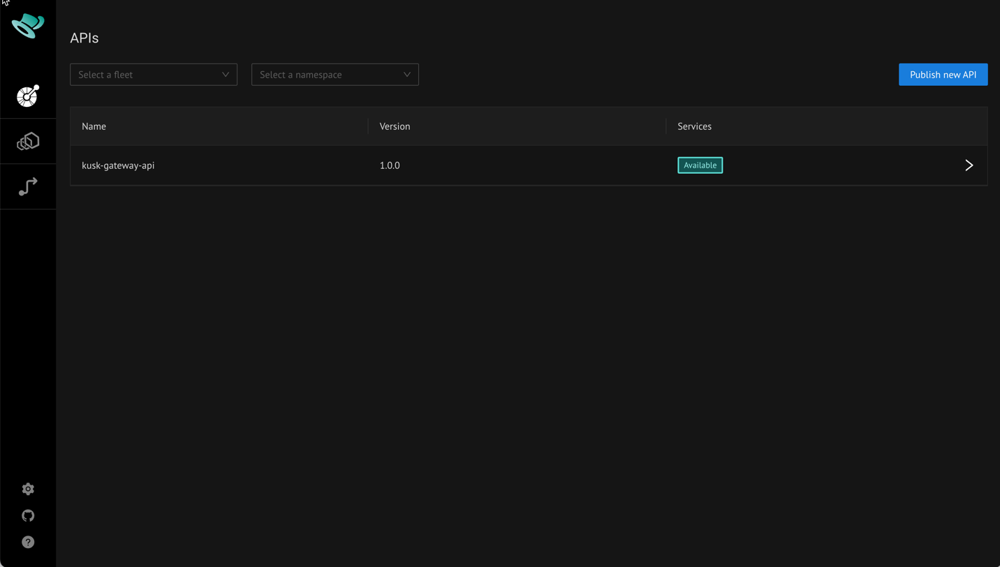
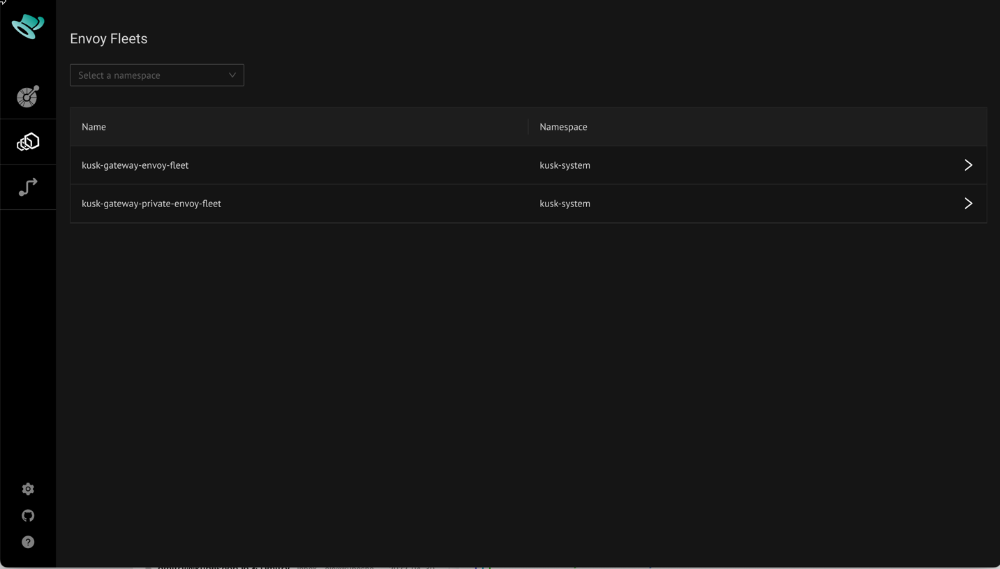
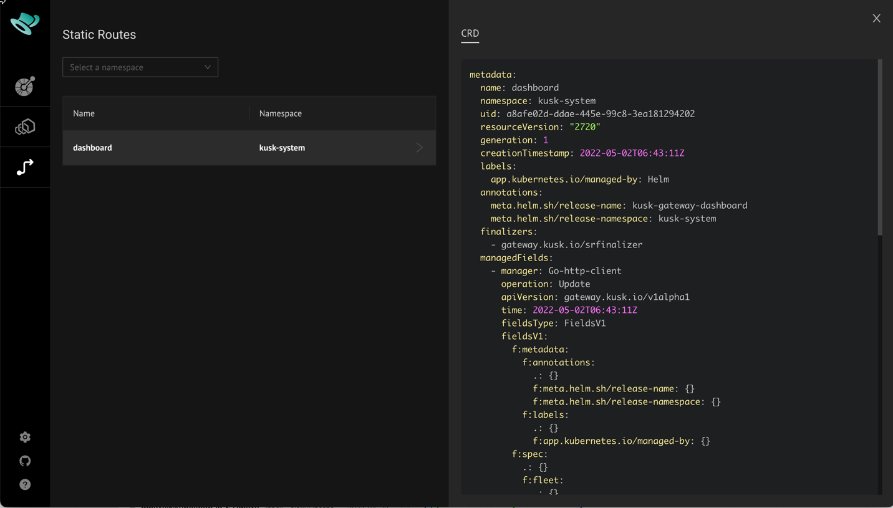
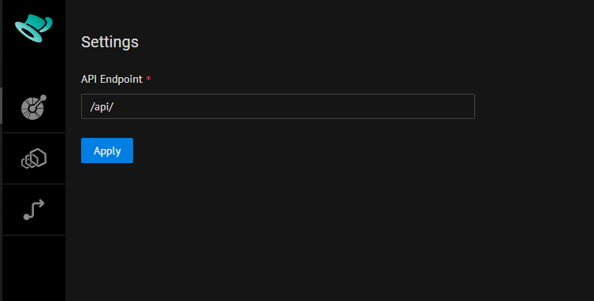

# Kusk Dashboard

Kusk Gateway includes a browser-based dashboard for inspecting deployed APIs, EnvoyFleets and StaticRoutes. For APIs
it is also possible to dig into the underlying OpenAPI definition and make ad-hoc requests to the API using the 
embedded Swagger-UI. 

The dashboard is installed as part of the [Kusk Installation](../cli/install-cmd.md) and published using Kusk Gateway
itself via dedicated EnvoyFleet, StaticRoute and API resources (which you can all see in the dashboard itself). 

After installing Kusk Gateway you can access the dashboard by running:

```shell
port-forward -n kusk-system svc/kusk-gateway-private-envoy-fleet 8080:80
open http://localhost:8080/
```

This will open the dashboard showing the kusk-gateway-api API Resource deployed through Kusk Gateway (the API that the dashboard 
itself uses):



Use the tabs on the top left to see deployed EnvoyFleets and StaticRoutes. The following EnvoyFleets are deployed by 
default:



And the following StaticRoute for exposing the dashboard itself:



Selecting any object will open a details panel to the right showing corresponding information - as shown in the screenshot 
above for the dashboard StaticRoute.

## Setting the API endpoint

By default the dashboard uses a backend API exposed on the same host as the dashboard itself with an '/api' path prefix.
If you host the dashboard or its API differently you can configure the API endpoint using the Settings button in the 
bottom left, which opens the following dialog:



You can specify any absolute URL or relative path here - just make sure that CORS is configured accordingly if you specify
a different host than the default one.


