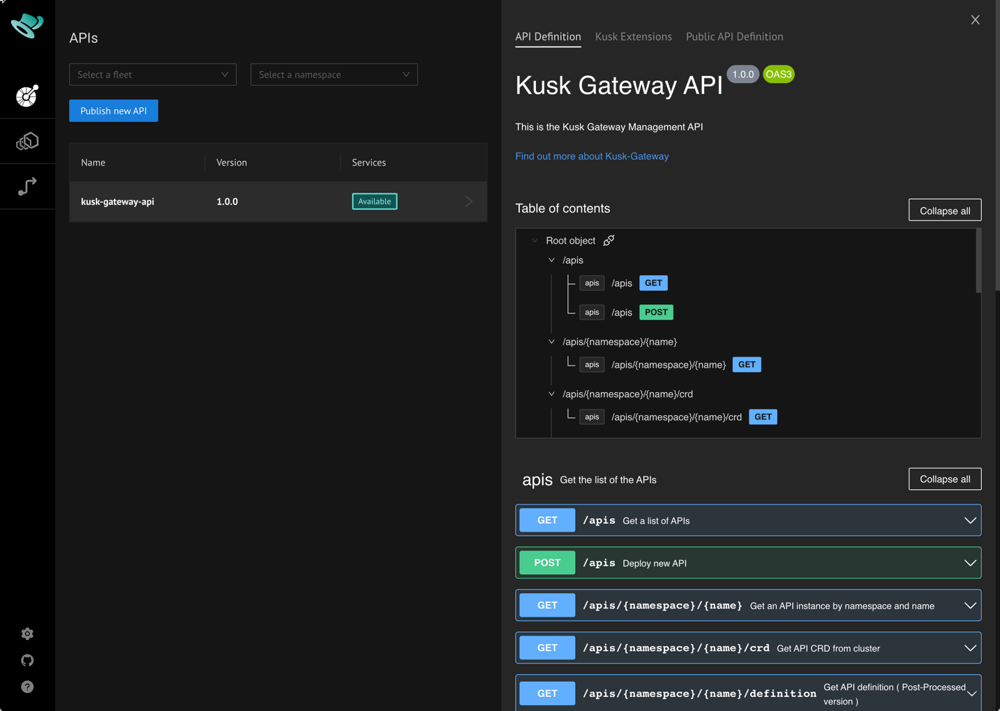
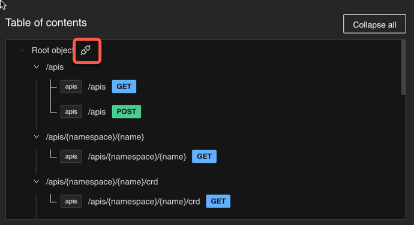
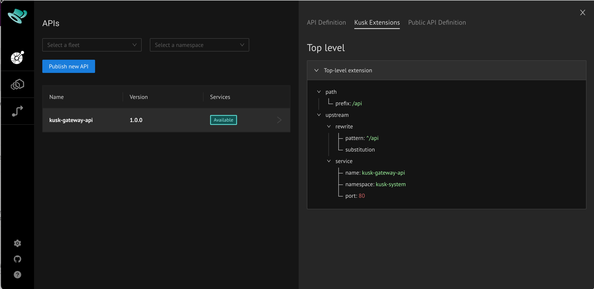
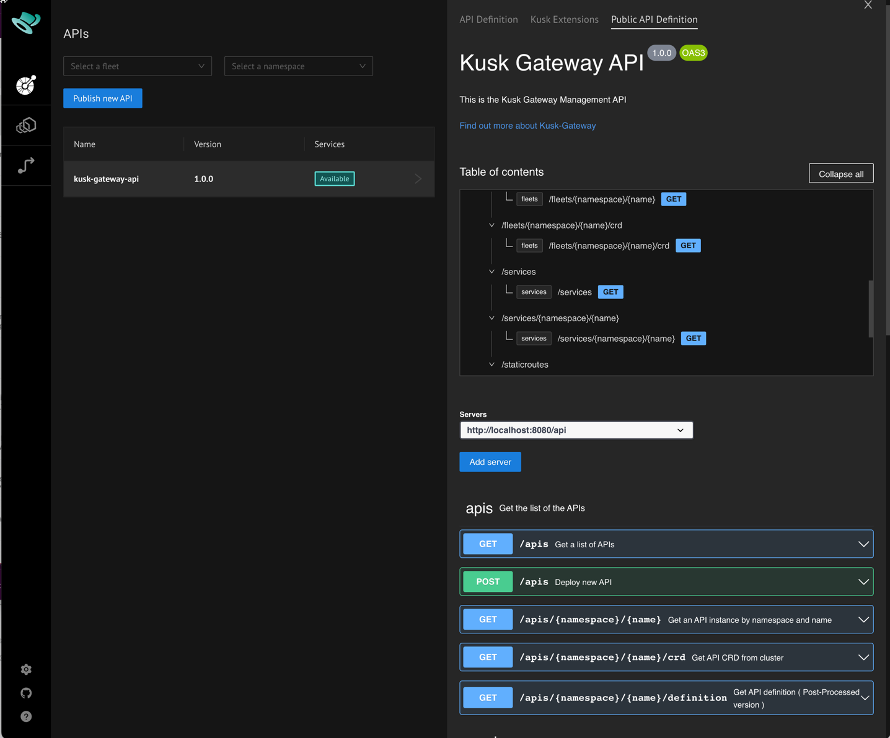
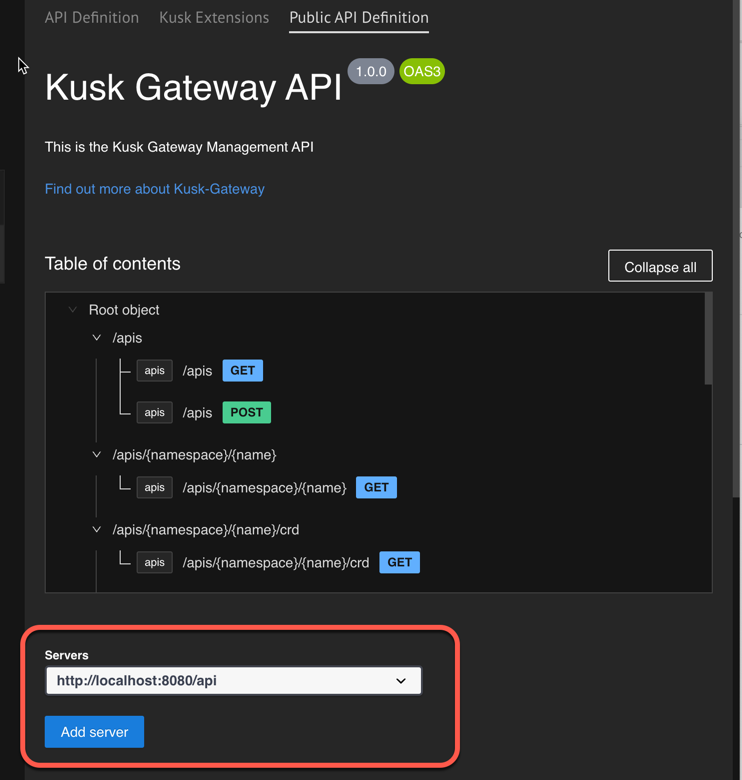
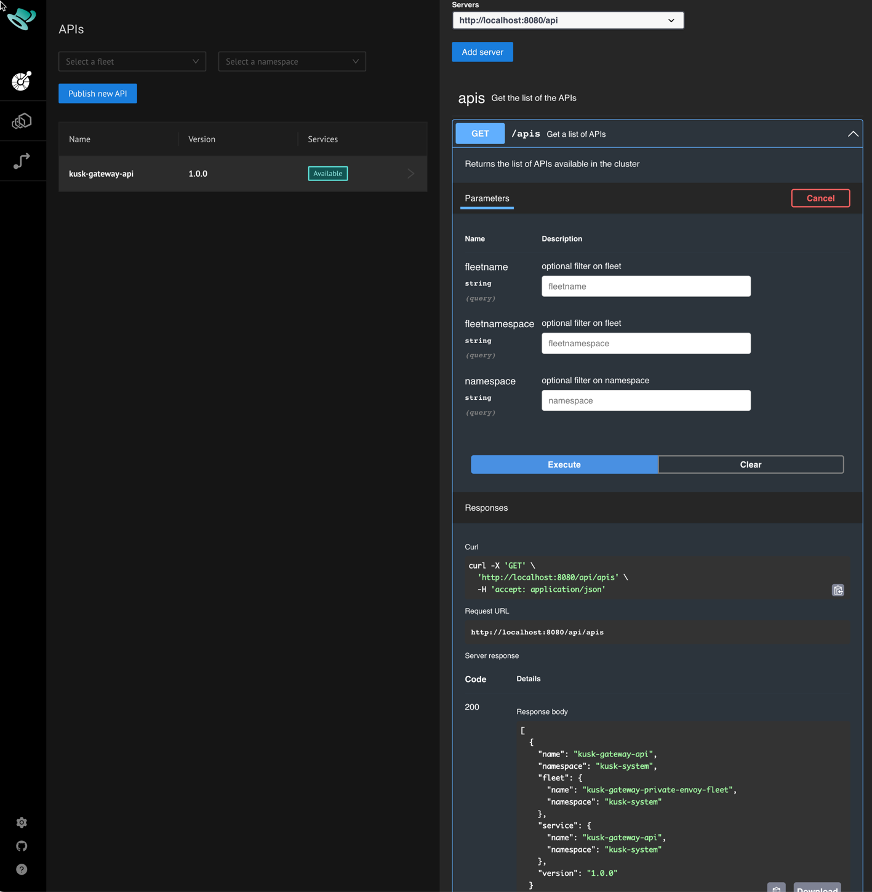

# Inspecting Deployed APIs 

Selecting a deployed API in the dashboard opens a corresponding details panel to the right containing 3 tabs:

- **API Definition**: Shows an extended Swagger UI for the OpenAPI that was deployed to Kusk Gateway. 
- **Kusk Extensions**: Shows an overview of all `x-kusk` extensions in the deployed OpenAPI definition.
- **Public API Definition**: Shows Swagger UI for the OpenAPI definition that would be exposed to consumers.

## **API Definition Tab**

The API definition tab shows a Swagger UI for the deployed API definition - together with a table of contents at the
top, making it easy to navigate to individual operations.

An indicator is shown next to any level in the Table of Contents if there is a `x-kusk` extension defined. 
Clicking it will open the corresponding extension in the Kusk Extensions tab (see below).

## **Kusk Extensions Tab**

The Kusk Extensions tab contains a tree view showing all `x-kusk` extensions that have been specified in the 
deployed OpenAPI definition - making it easy to understand how the API has been configured for Kusk Gateway.

## **Public API Definition Tab**

The Public API Definition tab contains the "post-processed" OpenAPI definition as you would provide publicly to consumers of your API. This differs from the deployed OpenAPI definition in the following ways:

- All `x-kusk` extensions have been removed.
- All disabled operations have been removed - see [Disabling Operations](../guides/routing.md#disabling-operations).

A Table of Contents is available as in the API Definition tab. 

This tab includes the possibility to specify server(s) to be used when executing requests through the integrated Swagger UI:

Specifying the server used by the dashboard itself allows us to execute requests against the Dashboard API. For example,
to get a list of APIs (as seen in the dashboard), we can execute the `GET /apis` operation.

