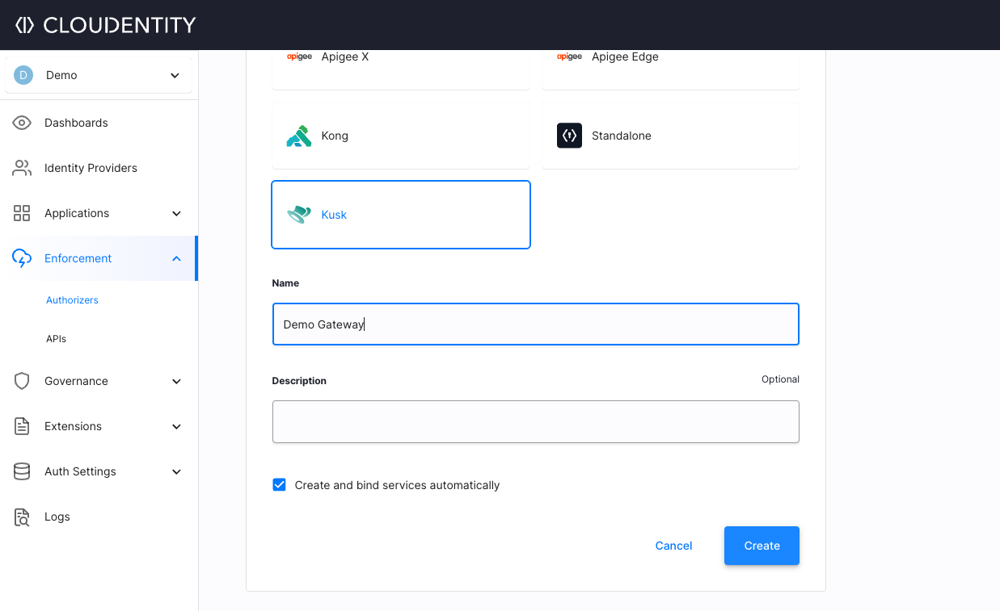
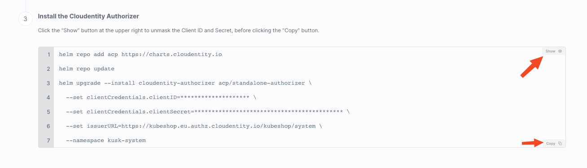
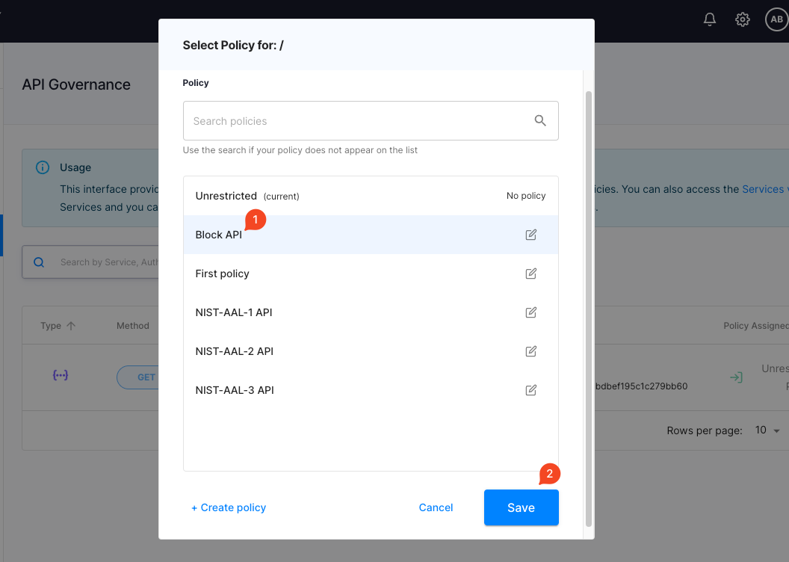

# Cloudentity

Kusk Gateway enables using third-party authentication and authorization management solutions such as Cloudentity.

Developers can utilize Cloudentity's platform to control their authorization flows while still using OpenAPI with Kusk to configure gateway level rules.

This separation of concerns is important when your authorization flow complexity grows or the number of services talking to each other require more authorization granularity.

## Setup guide

By the end of this guide, you will have deployed an API to Kusk and used Cloudentity to block requests to your API. 

### 1. Create Kusk Authorizer in Cloudentity

On Cloudentity's platform, go to **Enforcement > Authorizers**, click **CREATE GATEWAY**, and from the list that's displayed choose Kusk.



### 2. Install Cloudentity's authorizer in your cluster

The bottom of the quickstart section contains a `helm` command that installs Cloudentity's authorizer and configures it with credentials that are used to pull authorization policies from Cloudentity. 

Be sure to click on "Show" before copying the command so it can copy the credentials with the `helm` command.



Once copied, run the `helm` command in your terminal. 

You can check the installation of the authorizer with: 

```
kubectl get svc -A
NAMESPACE     NAME                                           TYPE           CLUSTER-IP      EXTERNAL-IP   PORT(S)                      AGE
...
cloudentity-authorizer-standalone-authorizer   ClusterIP      10.96.216.20    <none>        9004/TCP                     3h12m
...
```

### 3. Deploy an API with Kusk that uses Cloudentiy's authorizer

This is an example that uses a Kusk Policy with your OpenAPI definition to configure your gateway to use Cloudentity's authorizer with Kusk's mocking policy: 

`cloudentity-api.yaml` 

```yaml
openapi: 3.0.0
info:
  title: super-simple
  description: super simple api
  version: '0.1.0'
x-kusk:
  mocking:
    enabled: true
  auth:
    
    cloudentity:
      host:
        hostname: cloudentity-authorizer-standalone-authorizer.kusk-system # default authorizer service, change in case your authorizer is installed differently
        port: 9004
paths:
  /hello:
    get:
      responses:
        200:
          description: Return a hello world message
          content: 
            application/json:
              schema:
                type: object
                properties:
                  message:
                    type: string
              example:
                message: Mocked Response! 
```

Create the file and deploy it to your cluster: 

```bash
kusk deploy -i cloudentity-api.yaml
```

Without any additional configuration, you should be able to call the API without it being blocked and Kusk will return a mock response as configured in the example field: 

:::info
Cloudentity's authorizer pulls new rules on an interval of 1 minute. During that period after the initial confiugration your will receive responses with HTTP Status Code `403`. 
:::

```bash
curl $(kusk ip)

{"message":"Mocked Response!"}
```

### 4. Add an API Authorization Policy with Cloudentity

To see a simple example of how Cloudentity blocks an API, configure the simple authorization policy **"Block API"** with cloudentity to block all API calls. 

For that, on Cloudentity's portal, navigate to **Enforcement > APIs** where you'll see the list of paths that Kusk has synchronized with your Cloudentity's account.

Click on the policy column to add a **Block API** rule. 



### 5. Test that API calls are blocked

```
curl $(kusk ip) -v
...
< HTTP/1.1 403 Forbidden
< date: Tue, 04 Oct 2022 06:54:52 GMT
< x-envoy-upstream-service-time: 9
< server: envoy
< content-length: 0
```

:::info
Cloudentity's authorizer pulls new rules on an interval of 1 minute. During that period, your API calls will work with the old rules until the new ones are pulled. 
:::

