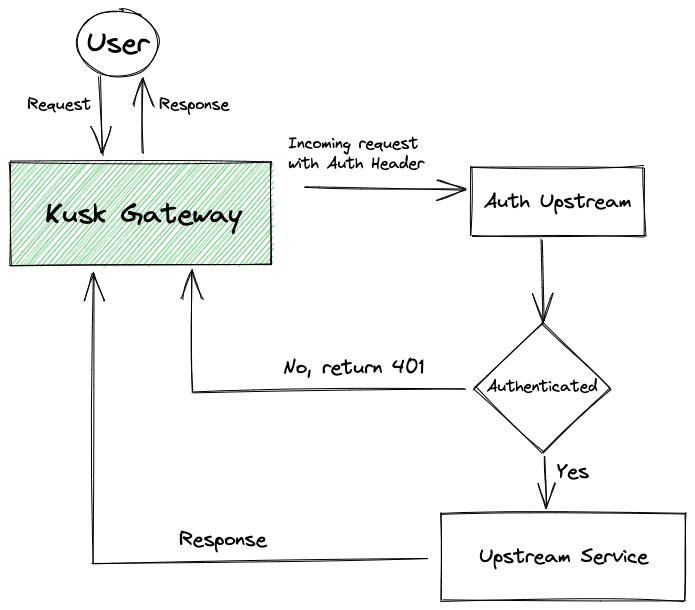

# Custom Authentication Upstream

Currently you can use any **Header based authentication** methods by means of custom Authentication Upstream . This includes:

- Basic Authentication
- JWT Tokens
- Bearer Tokens

To set up a custom authentication upstream, add the following section to your `x-kusk` settings block:

```yaml
openapi: 3.0.0
info:
  title: simple-api
  version: 0.1.0
x-kusk:
  auth:
    scheme: basic
    auth-upstream:
      host:
        hostname: auth-upstream-svc.default
        port:8080
```

:::info
The `hostname` field can contain internal cluster domains but also external domains to your cluster that can handle your header based authentication.
:::

The example above authenticates requests to the whole API.

You can also specify different authentication settings for specific operations or paths. The following example shows an example authentication configuration for a specific operation:

```yaml
...
paths:
  /hello:
    get:
      operationId: getHello
      auth:
        scheme: basic
        auth-upstream:
          host:
            hostname: auth-upstream-svc.default
            port:8080
      ..
```

In the example, in the `hostname` section we're referencing an upstream service in our cluster that will handle request authentication. The flow is as follows:



See all available Authentication configuration options in the [Extension Reference](../../extension/#authentication).
