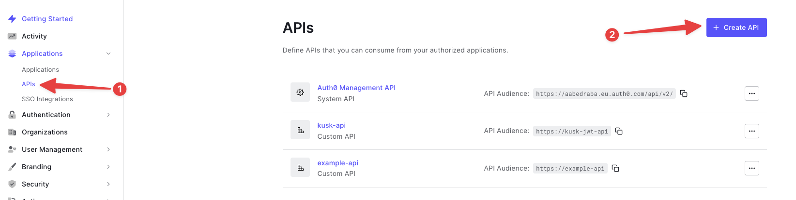
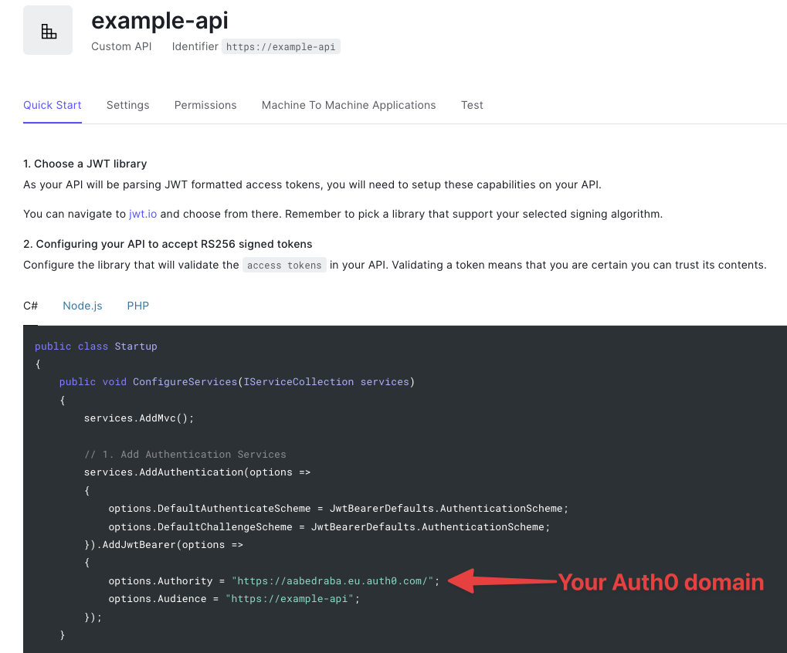

# JWT Authentication

Kusk allows you to protect your APIs in Kubernetes using JWT. In this guide you'll learn how to add JWT authentication to your API.

For the purposes of this example, we're using Auth0's JWT authentication.

## Example

### 1. Create an Auth0 JWT authentication 

1. Signup for an account at [Auth0](https://auth0.com/).
2. Create an Auth0 API Application. Go to Applications > APIs


3. Configure the following Auth0 Application fields: 
    1. Name (e.g. `example-api`)
    2. Identifier (e.g. `https://example-api`)
    3. Signing algorithm: RS256

Take note of your Auth0 domain, which you can find here: 



### 2. Deploy an API application to your Kubernetes cluster

```sh 
kubectl create deployment hello-world --image=kubeshop/kusk-hello-world:v1.0.0
kubectl expose deployment hello-world --name hello-world-svc --port=8080
```

```sh title="Expected output"
deployment.apps/hello-world created
service/hello-world-svc exposed
```

### 3. Create the OpenAPI definition to expose your API using Kusk

A minimal example of the configuration for the JWT filter is:

```yaml title="api.yaml"
openapi: 3.1.0
info:
  title: jwt-oauth0
  description: jwt-oauth0
  version: 0.1.0
x-kusk:
  upstream:
    service:
      name: hello-world-svc
      namespace: default
      port: 8080
  auth:
    jwt:
      providers:
        - name: kusk-gateway-jwt
          issuer: $ISSUER_URL
          audiences:
            - $JWT_AUDIENCE
          jwks: $JWKS_URL
paths:
  /hello:
    get:
      description: Returns a hello world greeting
      operationId: /hello
      responses: {}
```

You are required to change:

1. `issuer` (for example: `https://$AUTH0_DOMAIN`)
2. `audiences` (for example: `https://$AUTH0_IDENTIFIER`, you can get the Identifier field from the Settings tab)
3. `jwks` (for example: `https://$AUTH0_DOMAIN/.well-known/jwks.json`)

After that, deploy the API by running: 

```
kusk deploy -i api.yaml
```

### 4. Get a token from Auth0

The best way to get a token to test authentication with from Auth0 is using the `curl` command they offer in the test tab: 


Run the `curl` command and take note of the token: 

```sh
curl --request POST \
  --url https://aabedraba.eu.auth0.com/oauth/token \
  --header 'content-type: application/json' \
  --data '{"client_id":"$CLIENT_ID","client_secret":"$CLIENT_SECRET","audience":"https://example-api","grant_type":"client_credentials"}'
```

```sh title="Expected output"
{"access_token":"TOKEN_TO_COPY","expires_in":86400,"token_type":"Bearer"}
```

### 5. Test your authenticated API

Get the IP address of Kusk by running: 

```sh 
kusk ip

> 12.34.56.78
```

```sh
curl -H 'Authorization: Bearer "YOUR_TOKEN"' 12.34.56.78/hello
```

```sh title="Expected output"
{
    "message": "Hello from an implemented service!"
}
``` 

#### Example without Bearer token specified

```sh
curl 12.34.56.78/hello

> Jwt is missing
```

#### Example with invalid Bearer token

```sh
curl -H 'Authorization: Bearer invalid-token' 12.34.56.78/hello

> Jwt header is an invalid JSONShould pass since Bearer token is present
```

### Your API is now authenticated!

With Kusk, authenticating your APIs using JWT tokens is as easy as adding an extension to your OpenAPI definition. Stay safe out there!