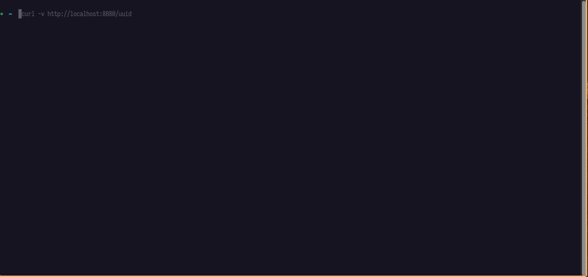
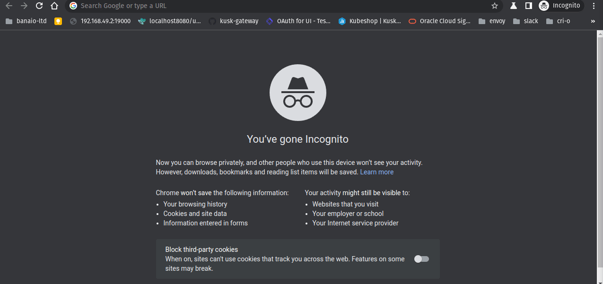

# `OAuth2`

:::caution

The OAuth2 feature is currently under active development.

:::

OAuth2 ensures that your application (upstream) doesn't get requests which are not authenticated and authorized. It effectively helps to protect your API. See the [`References`](./#references) section for further information.

## Upstream Issues

Certain OAuth2 features are blocked/constrained by upstream issues. Please see:

* [Segmentation Fault after `assert failure: false. Details: attempted to add shared target SdsApi <NAME_OF_SECRET> to initialized init manager Server](https://github.com/envoyproxy/envoy/issues/22678).
* [`SecretDiscoveryServiceServer`: `StreamSecrets` issues](https://github.com/envoyproxy/go-control-plane/issues/581).

So the implementation is constrained by these issues.

## Configuration

Kusk makes it easy to configure OAuth2, using the `auth` option in the `x-kusk` extension.

Be sure to read the [`Envoy Fleet`](#envoy-fleet) for how to configure Envoy Fleet to get the values for the `client_secret` and `hmac_secret`.

## Examples

### Example - Auth0

Example using [Auth0](https://auth0.com/):

#### Setup Guide

1. Signup for an account at [Auth0](https://auth0.com/).
2. Follow the steps as outlined in the video below, taking note of:
    1. `OAuth Authorization URL`.
    2. `OAuth Token URL`.
    3. Entering a comma separated list of `Allowed Logout URLs`, e.g., `http://<Envoy_LoadBalancer_IP>/oauth2/signout,https://<Envoy_LoadBalancer_IP>/oauth2/signout`.
    4. Entering a comma separated list of `Allowed Callback URLs`, e.g., `http://<Envoy_LoadBalancer_IP>/oauth2/callback,https://<Envoy_LoadBalancer_IP>/oauth2/callback`.
    5. `Client ID`.
    6. `Client Secret`.


Take note of the credentials as we will need this later on:

```json
{
  "client_id": "go8brZmF6eE6r7TObzpGaD5KFjJkm6Qb",
  "client_secret": "bkryzZGGA6Ko0VGnUEl_1YeREMHDpjGP8r1BTN1HYlmXpAWaiWNkD4bqIDuAuCKV"
}
```

#### Configuration

#### API Object

You are required to change:

1. `token_endpoint`.
2. `authorization_endpoint`.
3. `credentials.client_id`.
4. `credentials.client_secret`.
5. `auth_scopes`: Strictly speaking this is not required but we strongly suggest entering `openid` _only_ for now because as we mentioned earlier "OAuth2 feature is currently under active development".

An example `API` specification and associated deployments.

**api.yml**:

```yaml
apiVersion: gateway.kusk.io/v1alpha1
kind: API
metadata:
  name: auth-oauth2-oauth0-authorization-code-grant
  namespace: default
spec:
  fleet:
    name: default
    namespace: default
  spec: |
    openapi: 3.0.0
    info:
      title: auth-oauth2-oauth0-authorization-code-grant
      description: auth-oauth2-oauth0-authorization-code-grant
      version: '0.1.0'
    schemes:
    - http
    - https
    x-kusk:
      upstream:
        service:
          name: auth-oauth2-oauth0-authorization-code-grant-go-httpbin
          namespace: default
          port: 80
      auth:
        scheme: oauth2
        oauth2:
          token_endpoint: https://kubeshop-kusk-gateway-oauth2.eu.auth0.com/oauth/token
          authorization_endpoint: https://kubeshop-kusk-gateway-oauth2.eu.auth0.com/authorize
          credentials:
            client_id: go8brZmF6eE6r7TObzpGaD5KFjJkm6Qb
            client_secret: bkryzZGGA6Ko0VGnUEl_1YeREMHDpjGP8r1BTN1HYlmXpAWaiWNkD4bqIDuAuCKV
          redirect_uri: /oauth2/callback
          redirect_path_matcher: /oauth2/callback
          signout_path: /oauth2/signout
          forward_bearer_token: true
          auth_scopes:
            - openid
    paths:
      "/":
        get:
          description: Returns GET data.
          operationId: "/get"
          responses: {}
      "/uuid":
        get:
          description: Returns UUID4.
          operationId: "/uuid"
          responses: {}
---
apiVersion: apps/v1
kind: Deployment
metadata:
  name: auth-oauth2-oauth0-authorization-code-grant-go-httpbin
  namespace: default
  labels:
    app: auth-oauth2-oauth0-authorization-code-grant-go-httpbin
spec:
  selector:
    matchLabels:
      app: auth-oauth2-oauth0-authorization-code-grant-go-httpbin
  replicas: 1
  template:
    metadata:
      labels:
        app: auth-oauth2-oauth0-authorization-code-grant-go-httpbin
    spec:
      containers:
        - name: auth-oauth2-oauth0-authorization-code-grant-go-httpbin
          image: docker.io/mccutchen/go-httpbin:v2.4.1
          ports:
            - containerPort: 8080
---
apiVersion: v1
kind: Service
metadata:
  name: auth-oauth2-oauth0-authorization-code-grant-go-httpbin
  namespace: default
  labels:
    app: auth-oauth2-oauth0-authorization-code-grant-go-httpbin
spec:
  selector:
    app: auth-oauth2-oauth0-authorization-code-grant-go-httpbin
  ports:
    - name: http
      protocol: TCP
      port: 80
      targetPort: 8080
```

The example above ensures the whole API is protected via OAuth2, and that `auth-oauth2-oauth0-authorization-code-grant-go-httpbin` can be only accessed when authenticated and authorized.

#### Apply API Object

```sh
kubectl apply -f ./api.yml
```

### Envoy Fleet

**Note:**

* The commands assume you are running Linux.
* `192.168.49.2` is the `LoadBalancer` IP assigned to Envoy.

The secrets need to be part of the static Envoy Fleet configuration. The way to inject the `client_secret` and `hmac_secret` is as follows:

1. Change `secrets.token.generic_secret.secret.inline` to `"bkryzZGGA6Ko0VGnUEl_1YeREMHDpjGP8r1BTN1HYlmXpAWaiWNkD4bqIDuAuCKV"` by using `kubectl edit configmap/default`, i.e., look for this block:

```yaml
  secrets:
  - name: token
    generic_secret:
      secret:
        inline_string: "<stub_token_secret>"
```

And modify `inline_string`.

2. Port forward the admin port: `kubectl port-forward --namespace default service/default 19000:19000 &`
3. Restart Envoy by using `curl -X POST 'http: //localhost:19000/quitquitquit'`.
4. Wait until the changes to be propogated, this could take a while.
5. Delete and create the API again using `kubectl delete -f ./api.yml && kubectl apply -f ./api.yml`
6. Navigate to the protected route(s) in a browser, i.e., <http://localhost/uuid> or <https://localhost/uuid>.

The commands are listed below:

```sh
$ kubectl edit configmap/default
$ curl -X POST 'http: //localhost:19000/quitquitquit'
OK
$ kubectl delete -f ./api.yml && kubectl apply -f ./api.yml
$ # Open http://localhost/uuid or https://localhost/uuid in a browser.
```

### Complete End-2-End Run





## References

* [OAuth](https://en.wikipedia.org/wiki/OAuth).
* [What the Heck is OAuth?](https://developer.okta.com/blog/2017/06/21/what-the-heck-is-oauth).
* [Open Source OAuth 2.0 and OpenID Connect Server - gethydra.sh](https://www.ory.sh/hydra/).
* [`OAuth2 — envoy@latest`](https://www.envoyproxy.io/docs/envoy/latest/configuration/http/http_filters/oauth2_filter) or [`OAuth2 — envoy@v1.23.0`](https://www.envoyproxy.io/docs/envoy/v1.23.0/configuration/http/http_filters/oauth2_filter).
