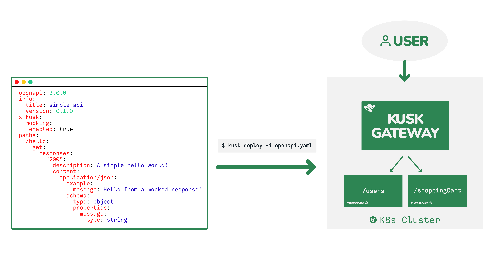

# Kusk Gateway

Kusk is a Kubernetes API gateway powered by [Envoy](https://www.envoyproxy.io/). The main difference with other API Gateways is that Kusk has native support for [OpenAPI](https://github.com/OAI/OpenAPI-Specification).

Modern REST APIs are developed using OpenAPI specification that is then used to generate API documentation, tests, server stubs and clients all from the OpenAPI definition. Kusk enables the use of OpenAPI definitions to configure the Ingress Controller of your Kubernetes clusters:

By using OpenAPI and Kusk you can:

- ⚡ **Rapidly prototype your APIs** by mocking your API responses
- 🥷🏽 Protect your endpoints with **automatic request and response validations**
- 🔥 Configure critical policies like request timeouts and CORS with **no coding required**
- 🧐 Centrally manage your APIs from an open source dashboard

Check out our [Getting Started](getting-started/install-kusk-cli.md) section to install Kusk Gateway, deploy an example API and connect a service to the API.