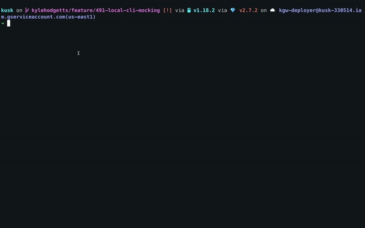

# `kusk mock`

Spin up a local mocking server that generates responses from your content schema or returns your defined examples.

Kusk uses [Docker](https://docs.docker.com/get-docker/) to launch a mock server container.

All you need to get started is your OpenAPI definition.

## Example
### Provide your API
Let's mock the following API using Kusk.

```yaml
openapi: 3.0.0
info:
  title: todo-backend-api
  version: 0.0.2
paths:
  /todos:
    get:
      responses:
        '200':
          description: 'ToDos'
          content:
            application/json:
              schema:
                type: object
                properties:
                  title:
                    type: string
                    description: Description of what to do
                  completed:
                    type: boolean
                  order:
                    type: integer
                    format: int32
                  url:
                    type: string
                    format: uri
                required:
                  - title
                  - completed
                  - order
                  - url
            application/xml:
              example:
                title: "Mocked XML title"
                completed: true
                order: 13
                url: "http://mockedURL.com"
            text/plain:
              example: |
                title: "Mocked Text title"
                completed: true
                order: 13
                url: "http://mockedURL.com"
```

It has a single path with 3 content types.
- `application/json` specifies a response schema which Kusk will generate a generated response that matches
- `applications/xml` and `text/plain` specifies examples which Kusk will return as is.

### Launch Kusk Mocking Server


```shell
$ kusk mock -i todo-backend-api.yaml
🎉 successfully parsed OpenAPI spec
☀️ initializing mocking server
🎉 server successfully initialized
URL: http://localhost:8080
⏳ watching for file changes in todo-backend-api.yaml 
```

The mock server is now running and will watch for any changes you make to fake todo-backend-api.yaml.

### Interacting with your API
Let's curl the endpoint for a JSON response

```shell
$ curl -H "Accept: application/json" localhost:8080/todos | jq
{
  "completed": true,
  "order": 507256954,
  "title": "Praesentium accusantium magni sequi saepe blanditiis. Officiis omnis sapiente laudantium quod. Vel dolorum voluptatibus sequi voluptatem voluptas nam.",
  "url": "http://sanfordconroy.name/elda.hills"
}
```

The response returns matches the schema that we defined under the `application/json` content response.

Let's now curl for `application/xml` and `text/plain`

```shell
$ curl -H "Accept: application/xml" localhost:8080/todos

<doc><completed>true</completed><order>13</order><title>Mocked XML title</title><url>http://mockedURL.com</url></doc>

$ curl -H "Accept: text/plain" localhost:8080/todos
title: "Mocked Text title"
completed: true
order: 13
url: "http://mockedURL.com"
```

Here the examples defined above are returned.

Kusk mock prioritises examples over schema definitions.

### Updating your API
Let's change the name of route `/todos` to `/foo`.

**Note** the file watcher doesn't pick up changes made in Vim - [related issue](https://github.com/fsnotify/fsnotify/issues/17). Use any other text editor to do this.

```yaml
openapi: 3.0.0
info:
  title: todo-backend-api
  version: 0.0.2
paths:
  /foo:
  ...
```

```shell
...
✍️ change detected in fake-api.yaml
☀️ mock server restarted
```

When a change is detected, the server is restarted to serve the upto date api.

Now we can curl the `/foo` endpoint as before.

```
$ curl -H "Accept: application/json" localhost:8080/foo
$ curl -H "Accept: application/xml" localhost:8080/foo
$ curl -H "Accept: text/plain" localhost:8080/foo
```

### Stop the server
`ctrl+c`
