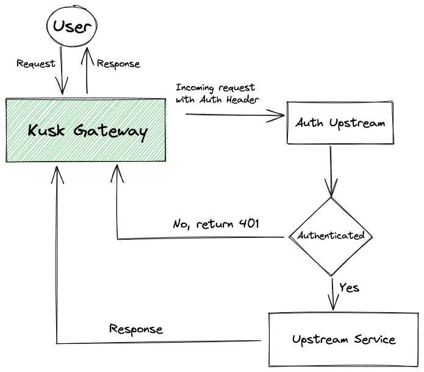

# Authentication

Currently you can use any Header based authentication methods. This includes:
- Basic Authentication
- JWT Tokens
- Bearer Tokens

To set up authentication, add the following section to your `x-kusk` settings block:

```yaml
openapi: 3.0.0
info:
  title: simple-api
  version: 0.1.0
x-kusk:
  auth:
    type: basic
    auth-upstream:
      host:
        hostname: basic-auth-svc.default
        port:8080
```

The example above authenticates requests to the whole API.

You can also specify different authentication settings for specific operations or paths. The following example shows an example authentication configuration for a specific operation:

```yaml
...
paths:
  /hello:
    get:
      operationId: getHello
      auth:
        type: basic
        auth-upstream:
          host:
            hostname: basic-auth-svc.default
            port:8080
      ..
```

As you can see in the example, in the `hostname` section we're referencing a service in our cluster that will handle the authentication of the requests. This flow looks like the following: 



!!! note non-important "`hostname` can contain any valid domain"

    The `hostname` field can contain internal cluster domains but also external domains to your cluster that can handle your header based authentication.

See all available Authentication configuration options in the [Extension Reference](../../reference/extension/#authentication).
