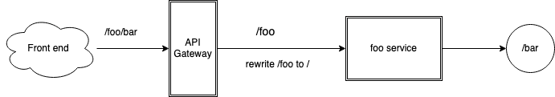

# Request Routing

Incoming requests to Kusk Gateway can be routed to the target service in two ways:

- Forwarded to an actual service in your cluster using the `upstream` property.
- Redirected to a different endpoint using the `redirect` property.

Furthermore, two properties are available to distinguish to which of these an incoming request should go:

- The `hosts` property allows you to define to which hostname(s) a specific API answers.
- The `path` property allows you to configure a base path for the exposed API.

Any of these properties can be specified at the root, path, or operation level in your OpenAPI 
definition, allowing you to route separate operations differently. For example, not all operations might be 
handled by the same service, in which case you could define different upstream services accordingly.

## **Forwarding Requests to a Service in your Cluster**

This will be the most common scenario - incoming requests to Kusk Gateway will be forward to a service or host running 
in your cluster:

```yaml
openapi: 3.0.0
info:
  title: simple-api
  version: 0.1.0
x-kusk:
  upstream:
    service:
      name: simple-api-service
      namespace: default
..
```

Here all requests are sent to the simple-api-service in the default namespace on the default port (80).

If we had a different service for one of the operations, we could override this at the operation level:

```yaml
openapi: 3.0.0
info:
  title: simple-api
  version: 0.1.0
x-kusk:
  upstream:
    service: 
      name: simple-api-service
      namespace: default
      port: 8001
path:
  /someoperation:
    get:
      operationId: doSomething
      x-kusk:
        upstream:
          service:
            name: another-service
            port: 8080
..
```

Here the default service is listening on port 8001 and we have specified a different service for the
doSomething operation, still in the same namespace but also on a different port.

If we instead wanted to route default API requests to different hostname, instead of a specific service,
we could do something like:

```yaml
openapi: 3.0.0
info:
  title: simple-api
  version: 0.1.0
x-kusk:
  upstream:
    host:
      hostname: simple-api-service-hostname
      port: 8001
..
```

Also, we could override this routing at the operation level as before:

```yaml
openapi: 3.0.0
info:
  title: simple-api
  version: 0.1.0
x-kusk:
  upstream:
    host:
      hostname: simple-api-service-hostname
      port: 8001
path:
  /someoperation:
    get:
      operationId: doSomething
      x-kusk:
        upstream:
          service:
            name: another-service
            port: 8080
..
```

### **Rewriting Request Paths**

The optional `rewrite` property allows us to modify the path of the request before forwarding
it to the upstream service. For example, if we have a service `foo` with a single endpoint `/bar`, we configure Kusk Gateway to forward traffic to the `foo` service when it receives traffic on a path with the prefix `/foo`.



If we receive a request at `/foo/bar`, the request will be forwarded to the `foo` service. `foo` will throw a 404 error as it doesn't have a path `/foo/bar`.

Therefore, we must rewrite the path from `/foo/bar` to `/bar` before sending it onto the `foo` service.

The following config extract will allow us to do this:

```yaml
upstream:
  service: 
    ...
  # /foo/bar/... -> to upstream: /bar/...
  rewrite:
    pattern: "^/foo"
    substitution: ""
```

See all available upstream configuration options in the [Extension Reference](/reference/extension/#upstream).

## Redirecting Requests to a Different Host/Path

Instead of forwarding requests to a service or hostname in our cluster, we might want to 
redirect the client to a totally different URL, for example, when:

- The API has moved to a different host.
- Individual operations have been renamed.

The `redirect` property allows us to do this. First, redirect to a different host:

```yaml
openapi: 3.0.0
info:
  title: simple-api
  version: 0.1.0
x-kusk:
  redirect:
    scheme_redirect: https
    host_redirect: thenewhost.com
    response_code: 302
..
```

This would redirect any requests to the API to the specified host using a 302 HTTP response.

As indicated above we could use this property to redirect individual operations:

```yaml
openapi: 3.0.0
info:
  title: simple-api
  version: 0.1.0
x-kusk:
  upstream:
    host: simple-api-service-hostname
    port: 8001
path:
  /newoperation:
    get:
      operationId: doSomething
      ..
  /oldoperation:
      x-kusk:
        redirect:
          path_redirect: /newoperation
..
```

This can be helpful when operations have been renamed during a major version update or if we want to deprecate an operation:

```yaml
openapi: 3.0.0
info:
  title: simple-api
  version: 0.1.0
x-kusk:
  upstream:
    host:
      hostname: simple-api-service-hostname
      port: 8001
path:
  /someoperation:
    get:
      operationId: doSomething
      ..
    put:
      x-kusk:
        redirect:
          scheme_redirect: https
          host_redirect: mywebsite.com
          path_redirect: /deprecated.html
..
```

See all available redirect configuration options in the [Extension Reference](/reference/extension/#redirect).

## **Specifying an External Path for Your API**

Often you will want to prefix your API path with something like "/api" externally, although your
internal API implementation is running on the root path "/". Kusk allows you to specify a 
`path` property for this, which you can use together with the rewrite described above in this scenario:

```yaml
x-kusk:
  path: /api
  upstream:
    service: 
      ...
    # /api/bar/... -> to upstream: /bar/...
    rewrite:
      pattern: "^/api"
      substitution: ""
```

## **Using Hosts for Multi-hosting Scenarios**

In a multi-hosting scenario for a single IP, you might want to ensure that requests to different hosts go to different APIs:

- https://onehost.com/api -> api nr 1
- https://anotherhost.com/api -> api nr 2

You can use the `hosts` property for this:

```yaml
openapi: 3.0.0
info:
  title: simple-api
  version: 0.1.0
x-kusk:
  upstream:
    service: simple-api-service
    namespace: default
  hosts:
     - onehost.com
..
```

Now, only requests to the onehost.com host will get forward to the simple-api-service.

## **Disabling Operations**

In certain situations, your OpenAPI definition might contain operations that you do not want exposed to API consumers, 
for example, if these are still in development or if they are meant to be consumed internally only. Kusk Gateway
provides a `x-kusk.disabled` property for this purpose, which can be set at the global, path or operation level.

For example, if we wanted to disable the PUT operation in one of our examples above we could add this extension:

```yaml
openapi: 3.0.0
info:
  title: simple-api
  version: 0.1.0
x-kusk:
  upstream:
    host:
      hostname: simple-api-service-hostname
      port: 8001
path:
  /someoperation:
    get:
      operationId: doSomething
      ..
    put:
      x-kusk:
        disabled: true
```

Setting this property to true at the top level will hide all operations, allowing you to override this 
property at the path or operation level when you want to expose only specific operations.
