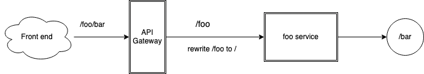

# OpenAPI extension

Kusk Gateway comes with an [OpenAPI extension](https://swagger.io/specification/#specification-extensions) to accommodate everything within
an OpenAPI spec to make that a real source of truth for configuring the gateway.

`x-kusk` extension has the following structure:

```yaml
x-kusk:
  hosts:
    - example.com
  
  disabled: false
  
  validation:
    request:
      enabled: true # enable automatic request validation using OpenAPI spec

  mocking:
    enabled: true # Enables mocking of the responses using examples in OpenAPI responses definition.

  upstream: # upstream and redirect are mutually exclusive
    host: # host and service are mutually exclusive
      hostname: example.com
      port: 80
    service: # host and service are mutually exclusive
      namespace: default
      name: petstore
      port: 8000
    rewrite:
      rewrite_regex:
        pattern: 'regular_expression'
        substituion: 'substitution'
      
  redirect: # upstream and redirect are mutually exclusive
    scheme_redirect: https
    host_redirect: example.org
    port_redirect: 8081
      
    path_redirect: /index.html # path_redirect and rewrite_regex are mutually exclusive
    rewrite_regex: # path_redirect and rewrite_regex are mutually exclusive
      pattern: 'regular_expression'
      substituion: 'substitution'
        
    response_code: 308
    strip_query: true
        
        
  path:
    prefix: /api
          
  qos:
    retries: 10
    request_timeout: 60 
    idle_timeout: 30

  cors:
    origins:
      - "*"
    methods:
      - POST
      - GET
      - OPTIONS
    headers:
      - Content-Type
    credentials: true
    expose_headers:
      - X-Custom-Header1
      - X-Custom-Header2
    max_age: 86200

  websocket: true
```

## Properties Overview

`x-kusk` extension can be applied at (not exclusively):

1. Top level of an OpenAPI spec:

```yaml
  openapi: 3.0.2
  info:
    title: Swagger Petstore - OpenAPI 3.0
  x-kusk:
    hosts:
    - "example.org"
    disabled: false
    cors:
      ...
```

2. Path level:

```yaml
openapi: 3.0.2
info:
  title: Swagger Petstore - OpenAPI 3.0
paths:
  /pet:
    x-kusk:
      disabled: true # disables all /pet endpoints
    post:
      ...
```

3. Method (operation) level:

```yaml
  openapi: 3.0.2
  info:
    title: Swagger Petstore - OpenAPI 3.0
  paths:
    /pet:
      post:
        x-kusk:
          upstream: # routes the POST /pet endpoint to a Kubernetes service
            service:
              namespace: default
              name: petstore
              port: 8000
        ...
```

## Property Overriding/inheritance

  `x-kusk` extension at the operation level takes precedence, i.e. overrides, what's specified at the path level, including the `disabled` option.
  Likewise, the path level settings override what's specified at the global level.

  If settings aren't specified at a path or operation level, it will inherit from the layer above. (Operation > Path > Global)

## Available properties

### disabled

This boolean property allows you to disable the corresponding path/operation, allowing you to "hide" internal operations
from being published to end users.

When set to true at the top level all paths will be hidden; you will have to override specific paths/operations with
`disabled: false` to make those operations visible.

### hosts

This string array property configures hosts (i.e. `Host` HTTP header) list the Gateway will listen traffic for. Wildcard hosts are supported in the suffix or prefix form, exclusively, i.e.:

- *.example.org
- example.*

### cors

The `cors` object sets properties for configuring [CORS](https://developer.mozilla.org/en-US/docs/Web/HTTP/CORS) for your API.

|       Name       | Description                                                     |
|:----------------:|:----------------------------------------------------------------|
|    `origins`     | list of HTTP origins accepted by the configured operations      |
|    `methods`     | list of HTTP methods accepted by the configured operations      |
|    `headers`     | list of HTTP headers accepted by the configured operations      |
| `expose_headers` | list of HTTP headers exposed by the configured operations       |
|  `credentials`   | boolean flag for requiring credentials                          |
|    `max_age`     | indicates how long results of a preflight request can be cached |

### qos

Options for configuring QoS settings, such as retries and timeouts.

|       Name        | Description                               |
|:-----------------:|:------------------------------------------|
|     `retries`     | maximum number of retries (0 by default)  |
| `request_timeout` | total request timeout (in seconds)        |
|  `idle_timeout`   | timeout for idle connections (in seconds) |

### websocket

An optional boolean field defines whether to enable handling of "Upgrade: websocket" and other related to Websocket HTTP headers in the request to create a Websocket tunnel to the backend. By default false, don't handle Websockets.

### upstream

This setting configures where the traffic goes. `service` and `host` are available and are mutually exclusive.
The `upstream` settings is mutually exclusive with `redirect` setting.

`service` is a reference to a Kubernetes Service inside the cluster, while `host` can reference any hostname, even
outside the cluster.

#### rewrite

Additionally, `upstream` has an optional object `rewrite`. It allows to modify the URL of the request before forwarding
it to the upstream service.

| Name                 | Description                     |
|----------------------|---------------------------------|
| rewrite.pattern      | regular expression              |
| rewrite.substitution | regular expression substitution |

#### service

The service object sets the target Kubernetes service to receive traffic, it contains the following properties:

|    Name     | Description                                      |
|:-----------:|:-------------------------------------------------|
| `namespace` | the namespace containing the upstream Service    |
|   `name`    | the upstream Service's name                      |
|   `port`    | the upstream Service's port. Default value is 80 |

#### host

The host object sets the target host to receive traffic, it contains the following properties:

|    Name    | Description                      |
|:----------:|:---------------------------------|
| `hostname` | the hostname to route traffic to |
|   `port`   | target port to route traffic to  |

Note: `service` and `host` are mutually exlusive since they define the same thing (the upstream host to route to).

#### Example

We have a service `foo` with a single endpoint `/bar`.

We configure Kusk Gateway to forward traffic to the `foo` service when it receives traffic on a path with the prefix `/foo`.



If we receive a request at `/foo/bar`, the request will be forwarded to the `foo` service. `foo` will throw a 404 error as it doesn't have a path `/foo/bar`.

Therefore we must rewrite the path from `/foo/bar` to `/bar` before sending it onto the `foo` service.

The following config extract will allow us to do this

```yaml
upstream:
  service: 
    ...
  # /foo/bar/... -> to upstream: /bar/...
  rewrite:
    pattern: "^/foo"
    substitution: ""
```

### path

The path object contains the following properties to configure service endpoints paths:

| Name   | Description                                                                              |
|--------|------------------------------------------------------------------------------------------|
| prefix | Prefix for the route  ( i.e. /your-prefix/here/rest/of/the/route ). Default value is "/" |

If `upstream.rewrite` option is not specified then the upstream service will receive the request "as is" with this prefix
still appended to the URL. If the upstream application doesn't know about this path, usually `404` is returned.

### redirect

Configures where to redirect request to. Redirect and upstream options are mutually exclusive.

| Name                       | Description                                                                 |
|----------------------------|-----------------------------------------------------------------------------|
| scheme_redirect            | redirect scheme (http / https)                                              |
| host_redirect              | host to redirect to                                                         |
| port_redirect              | port to redirect to                                                         |
| path_redirect              | path to redirect to                                                         |
| rewrite_regex.pattern      | regular expression (mutually exclusive with path_redirect)                  |
| rewrite_regex.substitution | regular expression substitution                                             |
| strip_query                | boolean, configures whether to strip the query from the URL (default false) |
| response_code              | redirect response code (301, 302, 303, 307, 308)                            |

### validation

The validation objects contains the following properties to configure automatic request validation:

| Name                       | Description                               |
|----------------------------|-------------------------------------------|
| validation.request.enabled | boolean flag to enable request validation |

#### strict validation of request bodies

Strict validation means that the request body must conform exactly to the schema specified in your openapi spec.
Any fields not in schema will cause the validation to fail the request/response.
To enable this, please add the following field to your schema block if the request body is of type `object`

```yaml
paths:
  /todos/{id}:
    ...
    patch:
      ...
      requestBody:
        content:
          application/json:
            schema:
              type: object
              # if you want strict validation of request bodies, please enable this option in your OpenAPI file
              additionalProperties: false
              properties:
                title:
                  type: string
                completed:
                  type: boolean
                order:
                  type: integer
                  format: int32l
```

Note: currently `mocking` is incompatible with the `validation` option, the configuration deployment will fail if both are enabled.

### mocking

`mocking` option enables the mocking of request responses using the provided in OpenAPI spec response definition [examples object](https://swagger.io/specification/#example-object).

Either `example:` (singular) or `examples:` (plural) are supported, however with multiple objects in `examples`, the response will include only one from that object map.
If both are specified, singular (`example`) has the priority over plural.

Examples are defined as a part of the response HTTP code and its contents media-type (e.g. `application/json`) and could be different for the different media types.

As part of the mocked response the related HTTP code is returned, but only succes codes are supported for the mocking. I.e. 200, 201, but not 400, 404, 500.
Though the OpenAPI standard allows the response code to be a range or being a wildcard (e.g. "2xx"), we need to know exactly what code to return, so this should be specified exactly as integer compatible ("200").
In case the response doesn't have the response schema, only the single http code is used to mock the response, i.e. the body is not returned.
This is useful to test, e.g. DELETE or PATCH operations that don't produce the body.

`mocking` is inheritable, i.e. if it is specified on the path or root level it will include every operation below it.
In case there are responses without the response schema but without the examples, these must be explicitly disabled with `mocking.enabled: false`, otherwise the configuration submission will fail.

Note: currently `mocking` is incompatible with the `validation` option, the configuration deployment will fail if both are enabled.

```yaml
      /mocked/{id}:
        # Enable mocking with x-kusk
        # Will enable mocking for all HTTP operations below
        x-kusk:
          mocking:
            enabled: true
        get:
          responses:
            # This HTTP code will be returned.
            '200':
              description: 'Mocked ToDos'
              content:
                application/json:
                  schema:
                    type: object
                    properties:
                      title:
                        type: string
                        description: Description of what to do
                      completed:
                        type: boolean
                      order:
                        type: integer
                        format: int32
                      url:
                        type: string
                    required:
                      - title
                      - completed
                      - order
                      - url
                  # Singular example has the priority over other examples.
                  example:
                    title: "Mocked JSON title"
                    completed: true
                    order: 13
                    url: "http://mockedURL.com"
                  examples:
                    first:
                      title: "Mocked JSON title #1"
                      completed: true
                      order: 12
                      url: "http://mockedURL.com"
                    second:
                      title: "Mocked JSON title #2"
                      completed: true
                      order: 13
                      url: "http://mockedURL.com"
                application/xml:
                  example:
                    title: "Mocked XML title"
                    completed: true
                    order: 13
                    url: "http://mockedURL.com"
                text/plain:
                  example: |
                    title: "Mocked Text title"
                    completed: true
                    order: 13
                    url: "http://mockedURL.com"
        patch:
          # Disable for patch
          x-kusk:
            mocking:
              enabled: true
        ...
```

With the example above, the response to GET request will be different depending on the client's preferred media type when using the `Accept` header.

Below we're using the example.com setup from the development/testing directory.

1. Curl call without specifying the Accept header. From the list of specified media types (application/json, plain/text, application/xml) - uses our default Mocking media type - application/json:

    ```shell
    curl -v -H "Host: example.com" http://192.168.49.3/testing/mocked/multiple/1

    < HTTP/1.1 200 OK
    < content-type: application/json
    < x-kusk-mocked: true
    < date: Mon, 21 Feb 2022 14:36:52 GMT
    < content-length: 81
    < x-envoy-upstream-service-time: 0
    < server: envoy
    < 
    {"completed":true,"order":13,"title":"Mocked JSON title","url":"http://mockedURL.com"}
    ```

    The response includes the `x-kusk-mocked: true` header indicating mocking.

2. With the Accept header, that has application/xml as the preffered type:

    ```shell
    curl -v -H "Host: example.com" -H "Accept: application/xml"  http://192.168.49.3/testing/mocked/1
    < HTTP/1.1 200 OK
    < content-type: application/xml
    < x-kusk-mocked: true
    < date: Mon, 28 Feb 2022 08:56:46 GMT
    < content-length: 117
    < x-envoy-upstream-service-time: 0
    < server: envoy

    <doc><completed>true</completed><order>13</order><title>Mocked XML title</title><url>http://mockedURL.com</url></doc>
    ```

3. With the Accept header specifying multiple weighted preffered media types, text/plain with more weight.

    ```shell
    curl -v -H "Host: example.com" -H "Accept: application/json;q=0.8,text/plain;q=0.9"  http://192.168.49.3/testing/mocked/1
    < content-type: text/plain
    < x-kusk-mocked: true
    < date: Mon, 28 Feb 2022 08:56:00 GMT
    < content-length: 81
    < x-envoy-upstream-service-time: 0
    < server: envoy
    < 
    title: "Mocked Text title"
    completed: true
    order: 13
    url: "http://mockedURL.com"

    ```
