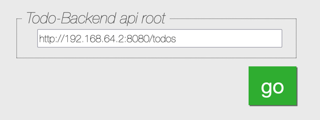
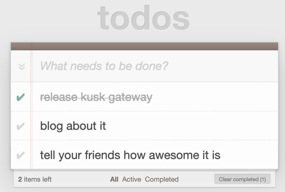

# TodoMVC step by step example

This [example](/examples/todomvc) will show you how to deploy a famous [TodoMVC](https://todomvc.com/) website using Kusk Gateway.
We chose the [TodoBackend](http://www.todobackend.com/) implementation for an example. The website consists of a Go-powered
[backend](/examples/todomvc/backend) and a NodeJS [SPA frontend](/examples/todomvc/frontend) that talks to the backend.

The backend application comes with an OpenAPI [specification](/examples/todomvc/todospec.yaml), which we will use to configure the Kusk Gateway.

In order to let the frontend communicate with the backend, modern browsers require [CORS](https://developer.mozilla.org/en-US/docs/Web/HTTP/CORS) to be properly
configured. Luckily, Kusk Gateway Manager allows you to do that right in your OpenAPI specification file using the **x-kusk** [extension](/docs/extension.md).

## Prerequisites
- Kusk Gateway Manager [installed](/docs/installation.md) into the cluster
- Envoy LoadBalancer IP is reachable from your browser - we will refer to it as `EXTERNAL_IP`

## Deploy services

1. First, deploy the backend and frontend services:
```shell
kubectl apply -f https://raw.githubusercontent.com/kubeshop/kusk-gateway/main/examples/todomvc/backend.yaml
kubectl apply -f https://raw.githubusercontent.com/kubeshop/kusk-gateway/main/examples/todomvc/frontend.yaml
```

2. Expose backend API via Kusk Gateway:
```shell
kubectl apply -f https://raw.githubusercontent.com/kubeshop/kusk-gateway/main/examples/todomvc/kusk-backend-api.yaml
```

3. Expose frontend via Kusk Gateway:
```shell
kubectl apply -f https://raw.githubusercontent.com/kubeshop/kusk-gateway/main/examples/todomvc/kusk-frontend-route.yaml
```

4. Test access
We assume that you have followed the [installation instructions](/docs/installation.md) and have determined the external IP of the EnvoyFleet Service:

```
export EXTERNAL_IP=192.168.64.2 # this IP is example, yours will be different
```

Now, open the frontend in your browser: (http://192.168.64.2:8080/) and put `http://192.168.64.2:8080/todos` as your backend endpoint:


You should now see the TodoMVC app running against your backend, with Kusk Gateway delivering traffic to it via the EnvoyFleet:


## How it's done - backend

Inside the `x-kusk` extension [upstream](/docs/extension.md#upstream) is specified so that Kusk knows where to route traffic to:
```yaml
x-kusk:
  upstream:
    service:
      namespace: default
      name: todo-backend
      port: 3000
```

Then, [CORS](/docs/extension.md#cors) is configured:
```yaml
x-kusk:
  upstream:
    service:
      namespace: default
      name: todo-backend
      port: 3000
  cors:
    origins:
      - '*'
    methods:
      - POST
      - PATCH
      - DELETE
      - PUT
      - GET
      - OPTIONS
    headers:
      - Content-Type
    credentials: true
    max_age: 86200
```

Now, in order to apply it to our cluster, you need to envelope it in a [API](/docs/customresources/api.md) CRD.
You can do it either manually:
```yaml
apiVersion: gateway.kusk.io/v1alpha1
kind: API
metadata:
  name: todo
spec:
  spec: |
    # your spec goes here - be careful about the indentation
```
Or by using [kgw](https://github.com/kubeshop/kgw) CLI tool:
```
kgw api generate -i https://raw.githubusercontent.com/kubeshop/kusk-gateway/main/examples/todomvc/todospec.yaml --name todo > kusk-backend-api.yaml
```

Apply it to the cluster:
```
kubectl apply -f https://raw.githubusercontent.com/kubeshop/kusk-gateway/main/examples/todomvc/kusk-backend-api.yaml
```

or pipe directly from **kgw** CLI - you can even do it in your CI/CD:
```
kgw api generate -i https://raw.githubusercontent.com/kubeshop/kusk-gateway/main/examples/todomvc/todospec.yaml --name todo | kubectl apply -f -

```

## How it's done - frontend

In order to configure access to services that do not have an OpenAPI specification,
Kusk Gateway allows you to use a [StaticRoute](/docs/customresources/staticroute.md) CRD.

Example `kusk-frontend-route.yaml` [file](/examples/todomvc/kusk-frontend-route.yaml):

```yaml
apiVersion: gateway.kusk.io/v1alpha1
kind: StaticRoute
metadata:
  name: todo-frontend
spec:
  # should work with localhost, example.org
  hosts: [ "localhost", "*"]
  paths:
  # Root goes to frontend service
    /: 
       get:
        route:
         upstream:
            service:
              namespace: default
              name: todo-frontend
              port: 3000
```

And apply it to the cluster:
```
kubectl apply -f https://raw.githubusercontent.com/kubeshop/kusk-gateway/main/examples/todomvc/kusk-frontend-route.yaml
```